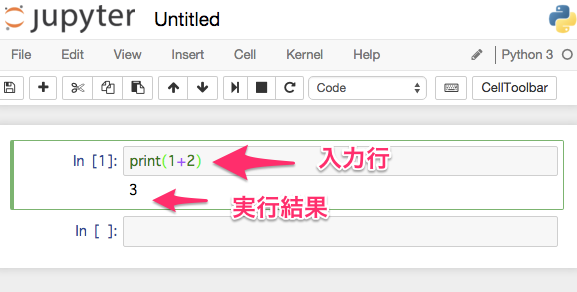
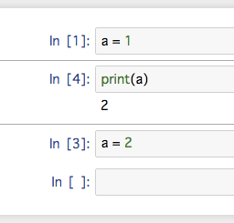

jupyter-notebook
==================

webサーバーとして起動してブラウザから使用するPython環境。

コードをメモとして残すことができる実行環境。


- ipython  
pythonのインタラクティブシェル
- ipython-notebook  
ipythonの機能をブラウザで使えるようにして、ノート機能などを実装
- jupyter  
julia, python, rなどを使えるipython-notebook環境からの派生


Pythonはカーネルの1つにすぎず、Rやjuliaなど様々なカーネルが使用可能。  
<https://github.com/ipython/ipython/wiki/IPython-kernels-for-other-languages>


使い方
----------

ホーム画面はファイラー的な画面。ファイルやフォルダを作成可能。

Notebookというファイルが特徴的なファイル。

Notebookは、REPL的な実行環境をサーバーで動作させ、ブラウザ上で操作する。各カーネルのNotebookを作成可能。今回はPythonを使用。

Notebookはセルという入力単位で処理を実行可能。セルにコードの断片を記述して実行できる。



セルに入力して、Shift+Enterで実行される。キーボードショートカットはヘルプを参照。
j,k,a,b,enterあたりを覚える。

スコープ・実行単位
--------------------
Notebook全体で1つのPythonプロセスが立ち上がっている感じ。Notebook内で1つのスコープ。

セルの実行順序は、つねに上から順番に実行しているわけではなく、セル単位で実行できるため個別に指定すれば順序どおりとはならない点に注意。

色々と試行錯誤するときには、任意のセルに移動してセルを実行したりするが、常に上から全部実行しているわけではないので注意する。

セルを実行した順序に番号が振られるので、それが実行順序になる。



結果出力の仕方
------------------
グラフの描画結果などをビジュアルとして出力するための設定をする。以下の設定はおまじないだと思って先頭に書く。

```python
%matplotlib inline
import pandas as pd
import numpy as np
import matplotlib
matplotlib.style.use('ggplot')
```

練習
----
以下の処理をするNotebookを作成してみる。

```python
%matplotlib inline
import pandas as pd
import numpy as np
import matplotlib
matplotlib.style.use('ggplot')
```

```python
# -3から3まで0.1ずつ増加させるx値
x = np.arange(-3, 3, 0.1)
```

```python
# xの値をsin関数に渡した結果y
y = np.sin(x) 
```

```python
# グラフを描画
plt.plot(x,y)
```


